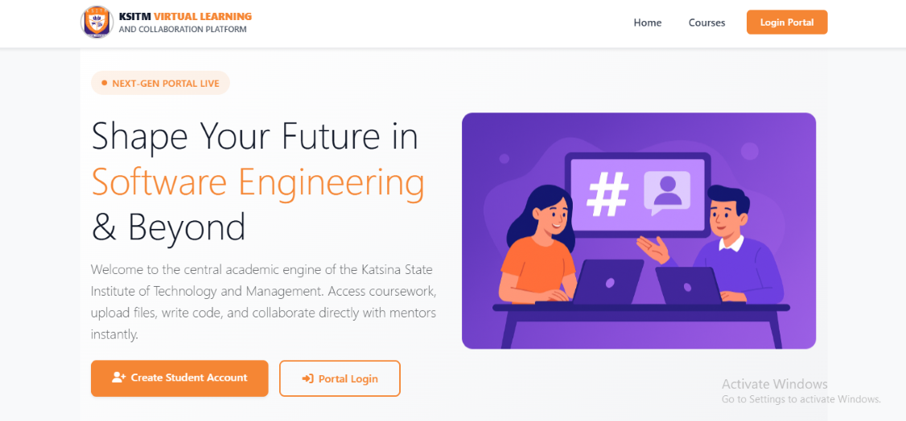

 <p align="center">
  
</p>
 

 🎓 University E-Learning & Collaboration Platform

 A modern digital learning ecosystem that enables universities to deliver online education, manage academic resources, foster collaboration, and improve student engagement through a secure, scalable, and responsive web platform.

<p align="center">


</p>

 
---

## 🌍 Live Demo

🔗 https://ksitm-vlcp-roan.vercel.app/

---
 ## 🚀 Overview

The University E-Learning & Collaboration Platform is a cloud-based learning management system built to modernize academic delivery through centralized digital learning, secure collaboration, and real-time educational workflows.

Developed using React, TypeScript, Firebase, and Tailwind CSS, the platform enables students and instructors to access course materials, submit assignments, collaborate in real time, and manage academic activities from a single responsive application.

The project demonstrates how modern frontend engineering, cloud services, and component-driven architecture can improve educational accessibility while maintaining performance, scalability, and maintainability across desktop and mobile devices.

---

 ## ✨ Core Features

### 🎓 Student Learning Dashboard
A centralized workspace where students can access enrolled courses, learning progress, announcements, assignments, and upcoming academic activities.

### 📚 Course & Content Management
Enables instructors to organize courses, publish lecture materials, upload resources, and manage structured learning content.

### 📝 Assignment & Assessment System
Provides assignment submission workflows, deadline management, grading support, and assessment tracking.

### 👥 Collaboration Workspace
Facilitates communication between students and instructors through collaborative learning spaces and shared academic interactions.

### 🔔 Academic Notifications
Keeps users informed about announcements, assignment deadlines, newly published resources, and important academic events.

### 🔐 Secure Authentication
Implements Firebase Authentication to provide secure user access while protecting academic information and user accounts.

### ☁️ Cloud-Based Data Synchronization
Uses Cloud Firestore to synchronize academic data in real time, ensuring consistency across devices and sessions.

### 📱 Fully Responsive Experience
Designed with a mobile-first approach to deliver a consistent experience across desktops, tablets, and smartphones.

### ⚡ Performance-Oriented Interface
Optimized component rendering, efficient state management, and reusable UI architecture contribute to a fast and reliable user experience.

---
 ## 🛠 Tech Stack

### Frontend

- React
- TypeScript
- Tailwind CSS
- Context API
- React Router

### Backend & Cloud

- Firebase Authentication
- Cloud Firestore
- Firebase Storage

### Development

- Vite
- Git
- GitHub
- Postman

 ---

 # 🏗️ Architecture

The University E-Learning & Collaboration Platform follows a scalable, component-driven architecture designed to support academic collaboration, secure user management, and cloud-based learning workflows.

The frontend is built with React and TypeScript using reusable UI components and modular page structures, while Firebase provides authentication, cloud database services, and real-time synchronization for academic data.

```text
Students / Lecturers
          │
          ▼
React + TypeScript Frontend
          │
Reusable Components
          │
Application State
          │
Firebase Services
 ├── Authentication
 ├── Cloud Firestore
 └── Cloud Storage
```

This architecture emphasizes:

- Modular and reusable component design
- Separation of presentation and business logic
- Secure authentication and role-based access
- Cloud-backed real-time synchronization
- Responsive rendering across desktop and mobile devices
- Maintainable code organization for future scalability
---

 # 🚧 Engineering Challenges

One of the most rewarding aspects of building this platform was designing an interface capable of supporting multiple academic workflows while maintaining a consistent and intuitive user experience.

Several engineering challenges emerged throughout development:

- Organizing reusable components across multiple learning modules.
- Maintaining responsive layouts for students, instructors, and administrators.
- Synchronizing cloud-based academic data efficiently using Firebase.
- Structuring scalable React components without introducing unnecessary complexity.
- Designing interfaces capable of presenting large amounts of educational content without overwhelming users.

These challenges were addressed through modular architecture, reusable UI components, centralized state management, and iterative interface refinement.

---
 # ⚡ Performance Optimizations

Several optimization techniques were implemented to improve responsiveness and maintainability throughout the application.

### Frontend Optimizations

- Lazy-loaded application modules
- Reusable React components
- Type-safe development using TypeScript
- Reduced unnecessary component re-rendering
- Optimized Firebase queries
- Mobile-first responsive layouts

### Code Quality

- Clean project structure
- Consistent component organization
- Modular styling with Tailwind CSS
- Maintainable folder hierarchy
- Improved developer experience for future contributors

---
 # 🎯 Project Impact

The University E-Learning & Collaboration Platform demonstrates how modern web technologies can improve accessibility, collaboration, and academic engagement within higher education.

The platform centralizes course delivery, digital resources, assessments, and collaborative learning into a unified experience, reducing administrative friction while improving access to educational content across desktop and mobile devices.

From an engineering perspective, the project strengthened my experience designing scalable React applications, building cloud-connected user interfaces, and creating responsive systems capable of supporting real-world educational workflows.

---

 # 📚 What I Learned

Building this platform strengthened both my technical and product-thinking skills.

Throughout development I gained deeper experience with:

- Designing scalable React applications using reusable component patterns.
- Building type-safe applications with TypeScript.
- Structuring cloud-connected applications using Firebase Authentication and Cloud Firestore.
- Managing application state across multiple academic workflows.
- Designing responsive interfaces that remain intuitive across desktop, tablet, and mobile devices.
- Improving maintainability through modular architecture and clean project organization.
- Translating real educational requirements into practical software solutions.
- Balancing user experience, performance, and long-term maintainability during development.

Perhaps the biggest lesson was understanding that successful software is not simply about adding features—it is about creating experiences that remain simple, reliable, and maintainable as the application grows.

---

# 🔮 Future Enhancements

The platform has been designed with future scalability in mind. Planned improvements include:

### 🤖 AI-Powered Learning Assistant
Provide intelligent tutoring, personalized study recommendations, and automated academic support.

### 🎥 Live Virtual Classrooms
Enable real-time online lectures with integrated video conferencing and collaborative learning sessions.

### 📊 Learning Analytics Dashboard
Deliver actionable insights into student engagement, course performance, and learning progress.

### 🔔 Smart Notifications
Real-time reminders for assignments, announcements, assessments, and academic events.

### 📱 Progressive Web App (PWA)
Improve accessibility through offline support and a mobile app–like experience.

### 🌍 Multi-language Support
Expand accessibility for students from diverse linguistic backgrounds.

### 📂 Advanced Document Management
Improve organization, sharing, and versioning of learning resources.

### 🔐 Role-Based Permissions
Provide granular access control for administrators, instructors, and students.


---

# 🚀 Getting Started

## Clone the Repository

```bash
git clone https://github.com/Sinsydev/KSITM-VLCP.git
```

## Navigate into the Project

```bash
cd KSITM-VLCP
```

## Install Dependencies

```bash
npm install
```

## Start the Development Server

```bash
npm run dev
```

The application will be available at:

```
http://localhost:5173
```

---

# 🔐 Environment Variables

Create a `.env` file in the project root and configure the following Firebase credentials:

```env
VITE_FIREBASE_API_KEY=
VITE_FIREBASE_AUTH_DOMAIN=
VITE_FIREBASE_PROJECT_ID=
VITE_FIREBASE_STORAGE_BUCKET=
VITE_FIREBASE_MESSAGING_SENDER_ID=
VITE_FIREBASE_APP_ID=
```
 
---

# 📂 Project Structure

```
src/
│
├── assets/           # Images, icons, fonts
├── components/       # Reusable UI components
├── pages/            # Application pages
├── layouts/          # Shared layouts
├── hooks/            # Custom React hooks
├── services/         # Firebase & external services
├── utils/            # Helper functions
├── types/            # TypeScript interfaces
├── context/          # Global state management
└── styles/           # Global styling
```

The project follows a modular architecture that encourages maintainability, scalability, and component reusability.

---

# 🧪 Build for Production

Create an optimized production build:

```bash
npm run build
```

Preview the production build locally:

```bash
npm run preview
```

The generated production files will be located inside the `dist/` directory and are ready for deployment.

---

# 🤝 Contributing

Contributions, suggestions, and constructive feedback are always welcome.

If you'd like to improve the project:

1. Fork the repository.
2. Create a feature branch.
3. Commit your changes.
4. Open a Pull Request.

Please ensure that new contributions follow the existing project structure and coding conventions.

---

# 👨‍💻 About the Author

**Ismail Aminu Said**

Software Engineer passionate about building scalable web applications, AI-powered platforms, and modern user experiences using React, TypeScript, and Firebase.

### 🌐 Portfolio

https://ismailaminusaid.netlify.app

### 💼 LinkedIn

https://linkedin.com/in/sinsy-dev

### 💻 GitHub

https://github.com/Sinsydev

### 📧 Email

ismailaminusaid1234@gmail.com

---

# 📄 License

This project is available for educational, demonstration, and portfolio purposes.

If you would like to discuss commercial usage or collaboration opportunities, feel free to get in touch.


---

# ⭐ Support

If you found this project interesting or helpful:

- ⭐ Star the repository
- 🍴 Fork the project
- 💡 Share your feedback
- 🤝 Connect with me on LinkedIn

Every contribution, suggestion, and connection is greatly appreciated.


--- 

<div align="center">

### Building modern software that makes education more accessible, collaborative, and impactful.

**Thank you for visiting this project! 🚀**

</div>
 
